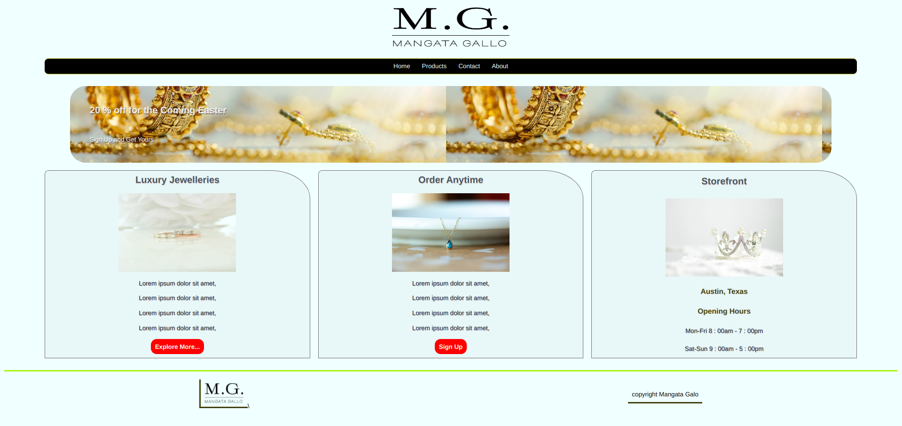

# mangata-galo
A home page for a fictional client in Austin, Texas.

   I did this project according to design requirements for better UX and non-distracting UI.

# In this project, I demonstrated my skills of the following concepts:

**Semantic HTML**

   - The HTML is semantically structured for SEO optimazation and web accessibilty.

**The Layout**

   - The layout is designed considering responivines of the page.
   -It is mainly of flexbox.

**Effects and Transitions**

   - Effects and transitions are applied to give a user a good experience and  interactivity.

# Purpose of the project

  I did this project as a final project while taking **Advanced HTML and CSS** course from  **Meta** on **Coursera**, the course is part of a **Meta's Proffessional Front-end Developer Certificate**.

# Live Demo

[Here's a live demo](https://uwancha.github.io/mangata-galo/)